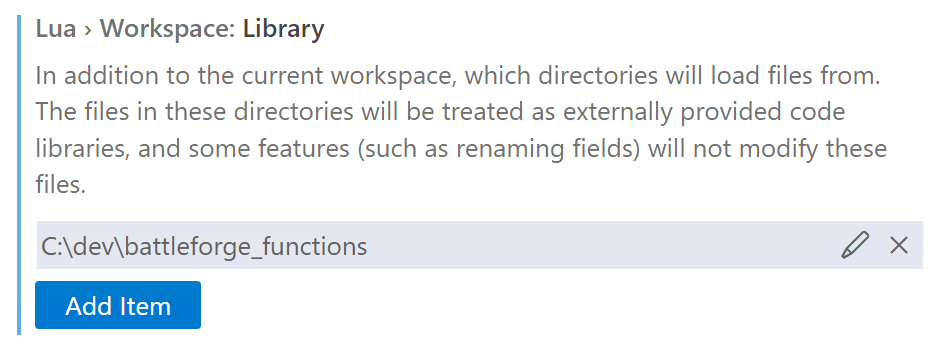

### What is this?
This is a tool made for SkylordsReborn.
It takes the Wiki-Templates of every Page located in the Wiki-Category [GDSFunctionExport](
https://skylords-reborn.fandom.com/wiki/Category:GDSFunctionExport)
and converts it into Powershell Objects.

Which then can be used for every future project, that wants to access the Documentation of Map-Script-Functions

[convertFromWikiTemplatesClasses.ps1](convertFromWikiTemplatesClasses.ps1):\
For example it can be used to generate the Function-Definitions that can be used by lua-language-server to display the intellisense for Map-Scripts ([functions_generated.lua](functions_generated.lua))

Or just saved as a JSON-File ([functions_generated.json](functions_generated.json))

### How to use?
- Install Visual Studio Code
- Install the [lua-language-server](https://github.com/LuaLS/lua-language-server) extension (can be installed from within Visual Studio Code) 
- If you want the latest functions_generated.lua directly sucked out of the wiki, run convertFromWikiTemplatesClasses.ps1
- Make the functions ([functions_generated.lua](functions_generated.lua), [static_functions_enums.lua](static_functions_enums.lua)) accessible for [lua-language-server](https://github.com/LuaLS/lua-language-server)
    - copy them into your map-project directory
    - OR copy them eg. to `C:\dev\battleforge_functions` and add that folder in the VSCode-extension-settings (`Lua.workspace.library`)\
      
