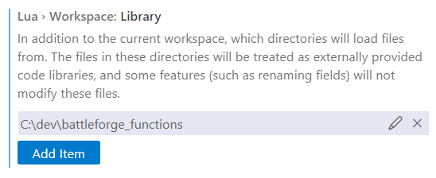

### What is this?
This is a tool made for SkylordsReborn.
It takes the Wiki-Templates of [Script Information - Full Reference](
https://skylords-reborn.fandom.com/wiki/Script_Information_-_Full_Reference)
and converts it into Powershell Objects.

Which then can be used for every future project, that wants to access the Documentation of Map-Script-Functions

[convertFromWikiTemplatesClasses.ps1](convertFromWikiTemplatesClasses.ps1):\
For example it can be used to generate the Function-Definitions that can be used by lua-language-server to display the intellisense for Map-Scripts ([functions_generated.lua](functions_generated.lua))

Or just saved as a JSON-File ([functions_generated.json](functions_generated.json))

### How to use?
- Install Visual Studio Code
- Install the [lua-language-server](https://github.com/LuaLS/lua-language-server) extension (can be installed from within Visual Studio Code) 
- If you want the latest functions_generated.lua directly sucked out of the wiki, run `convertFromWikiTemplatesClasses.ps1`
- Make the functions ([functions_generated.lua](functions_generated.lua), [static_functions_enums.lua](static_functions_enums.lua)) accessible for [lua-language-server](https://github.com/LuaLS/lua-language-server)
    - copy them into your map-project directory
    - OR copy them eg. to `C:\dev\battleforge_functions` and add that folder in the VSCode-extension-settings (`Lua.workspace.library`)\
      
- Disable diagnostic `newfield-call` (`Lua.diagnostics.disable`)\
    

### What is missing?
- Currently, there is no export for (the data is instead provided via [static_functions_enums.lua](static_functions_enums.lua))
    - Enums
    - Events
    - WarfarePatterns
- Some functions still need to be compared to the decompiled scripts
- Currently, most of the functions have not been verified yet. They may not be acurate!

### Wiki-Template-Structure
The data is saved in Mediawiki-Templates. `{{TemplateName}}` includes the Template TemplateName into the current page. Parameters can be added via the Pipe-Sign `{{TemplateName|Parameter1=xyz}}`. These parameters then can be accessed inside the template itself. 

```powershell
# This defines a Category. Every Function below this, will be added to the Category *CategoryName*
{{GDSFunctionCategory|Name=CategoryName}}

# Functions will be definded via GDSFunctionHEAD.
{{GDSFunctionHEAD
|Name=FunctionName
|Desc=This is the description of Function FunctionName
|Veri=false    # Has this Function been verified? 
|Sample=
OnOneTimeEvent
{
	Conditions =
	{
		[...]
	},
	Actions = 
	{
		[...]
	},
};
}}

# for every Parameter of the Function, a {{GDSFunctionParameter}}  is added.
# If the function has no parameters, everything below can be left out.
{{GDSFunctionParameter
|Type=string
|Name=Parameter1
|Desc=This is the description of Parameter1
}}
{{GDSFunctionParameter
|Type=string
|Name=Parameter2
|Desc=This is the description of Parameter2
}}
```

### How can I help?
You can verify and correct functions:\
Are the Description, Parameters, Parameter-Descriptions, Optional-Flag correct?\
If the are, please set the `Veri` Parameter of the `GDSFunction` Template to true.\
If they are not, please correct them

### Disclosure
EA has not endorsed and does not support this product.
